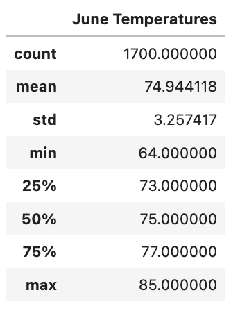
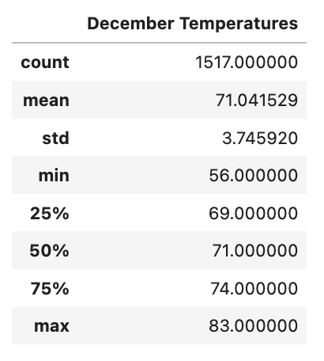
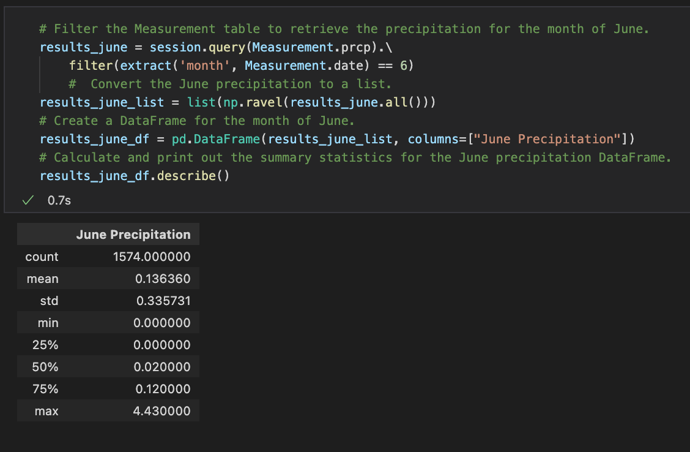
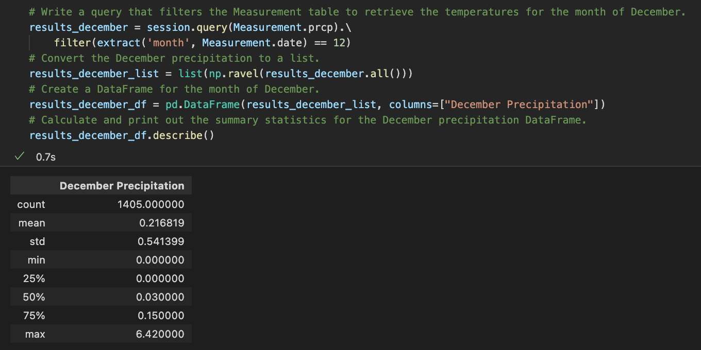

# Surfs Up

## Purpose

The purpose of this project is to analyze temperature trends for the months of June and December in Oahu. This analysis will help determine if opening a surf and ice cream shop business is sustainable year-round.

## Results

### Results for June

- The average temperature recorded throughout June is 75 degrees. A low standard deviation of 3 means most temperatures recorded are close within the average temperature. This shows that weather is consistently warm and stable throughout the month of June.

### Results for December

- Average temperatures recorded for the month of December is 71 degrees, only 4 degrees lower than June but still considered relatively warm. December also has a low standard deviation of 4 indicating that weather is consistently warm and stable throughout the month of December.

- One of the lowest temperatures recorded in December was 56 degrees. However, more than 50% of the data recorded is above 70 degrees, indicating relatively warm weather. 

## Summary

- The temperatures recorded for the months of June and December show that temperatures are relatively warm throughout the year, a good indication that opening a surf shop with an ice cream shop is sustainable year-round.
- One piece of data I would look into is the average precipitation that occurs in June and December. Heavy precipitation can potentially curve sales in the surf and ice cream shop. 
- The following two queries can be used to find the average precipitation for the months of June and December:

